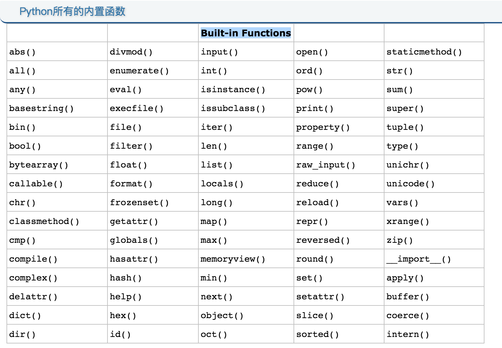

### 巴萨诺瓦的开始
当阿姆斯特朗开始演唱《玫瑰人生》，声音不大，但他那标志性沙哑声音一下充满了整个空间。执一杯微热的黄酒，慢慢的送入口中。胸中淡冷的感觉在黄酒的作用下，慢慢有了温暖的感觉。感觉在那一瞬间停止了，没有了空间，没有了时间。这种感觉就是在零下10度并且还有大风的情况下骑自行车想要获得的。

### 内置函数
Python内置了很多函数，这些函数可以直接拿来就用。下面就开始试试:

```
abs(-521)
```
上面就是用内置函数处理的方式。可以看看结果。这个函数的作用就是绝对值。就像在前几章之前讲的一样，我们不用重复的制止轮子。绝对值的功能早就被造好了。恩，那用大腿想一想，以下两个函数是干啥用的？

```
max(1, 2)
min(3, 4)
pow(2, 3)
```
应该不是太复杂，上面三个函数的意思，分别是取最大值，取最少值，还有乘方值。   
再试试下面的：

```
'cat'.capitalize()
```
要注意都用英文的标点哦。应该很直观了。就是把首字母大写的方法。不要停，再试试下面的。

```
'cat'.replace('t', 'r')
```
试完的感觉如何？瞬间把猫变成汽车了。是不是很有成就感？   
下面这个图就是更多的内置函数：


### 模块
还记得之前的小乌龟吗？那个就是Python中的模块。我们现在在来学习更多的模块。   
使用模块的第一步是要引用，就是要把相关的东西做出关联的意思。

```
import random
```
然后输入：

```
print(random.randint(1, 53406))
```
看看输出的结果，然后再输出一下看看。（提示:不用用手再打一遍，而是按一下键盘右下角的向上箭头的那个键。怎么样？上次输入的是不是有出来了？）
再多输出几次看一下。是不是发现每次的输出结果都不一样？这个就是随机数的模块。我们用这个函数，就可以开发的自己的骰子游戏了。

randint(n,m)的意思就是从n到m中随机一个数。

再来一个，我很多时候是有选择障碍的，那就用随机模块自动帮我选一个个吧。
```
names = ['cat', 'car', 'pen']
print(random.choice(names))
```
哈哈，这个用一次就好。因为每次输出的结果都不是一样的哦。用的多了，也不知道选啥了。

再了学一个时间模块吧。要用很简单，第一步要引入

```
import time
```
引入之后可以来讲个最简单的

```
print(time.time())
```
输出的应该一个奇怪的数字。这个数字其实是从1970年1月1日0时到现在的秒数。有时候要统计你用了长时间就可以用这个函数。先记录一个时间，然后用使用后的时间相减，就可以知道你用了多久了。理论很简单吧。

```
print(time.localtime(time.time()))
```
看输出就可以知道当前时间的详情信息了。

```
print(time.strftime("%Y-%m-%d %H:%M:%S", time.localtime()))
```
按照想要的格式输出日期。

### 总结
今天学了很多东西，可以放松一下了。


本文档是有特殊意义，未经许可，请勿转载。